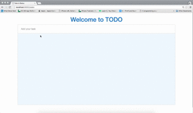

# redux_todo_demo

This is a simple todo app made using react js and redux js. The tasks added gets saved in the database provided by built.io (built.io backend).To know more about built.io backend visit:
<a href="https://www.built.io/products/backend/overview">https://www.built.io/products/backend/overview</a>

The main purpose of this application is to make one understand the basic flow of data in application built with redux and react.

To start the app all you need to do is run 'gulp build'.

Screenshots 
------------ 
 